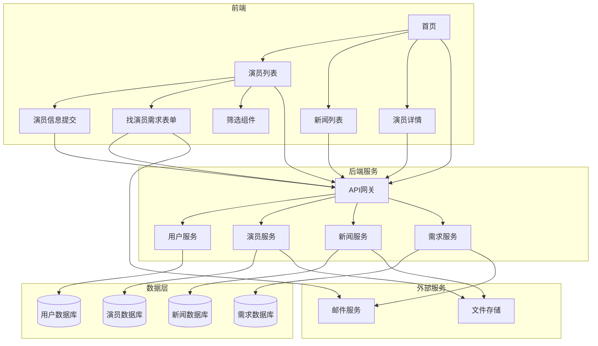

# 演员资源库技术设计文档

Feature Name: actor-resource-library
Updated: 2026-01-28

## 描述

演员资源库是一个基于Web的内容管理和展示平台，采用前后端分离架构。前端负责用户界面和交互，后端提供API服务和数据持久化。系统支持演员信息管理、新闻发布、需求提交等核心功能，采用橘色主题设计，响应式布局适配多种设备。

## 架构



## 组件和接口

### 前端组件

#### 首页组件 (HomePage)
- **职责**: 展示平台概况、海报轮播、导航入口
- **接口**:
  - `GET /api/posters` - 获取海报列表
- **子组件**:
  - PosterCarousel (海报轮播)
  - NavigationBar (导航栏)
  - QuickLinks (快捷链接)

#### 演员列表组件 (ActorListPage)
- **职责**: 展示演员列表，提供筛选功能
- **接口**:
  - `GET /api/actors?gender=&ageGroup=&page=1&pageSize=20` - 获取演员列表
- **子组件**:
  - ActorCard (演员卡片)
  - FilterBar (筛选栏)
  - Pagination (分页组件)

#### 演员详情组件 (ActorDetailPage)
- **职责**: 展示单个演员的详细信息
- **接口**:
  - `GET /api/actors/{id}` - 获取演员详情
- **子组件**:
  - ActorProfile (演员资料)
  - ActorWorks (演艺经历)

#### 演员信息提交组件 (ActorSubmissionForm)
- **职责**: 提供演员信息提交表单
- **接口**:
  - `POST /api/actors` - 提交演员信息
  - `POST /api/upload` - 上传文件
- **子组件**:
  - FormField (表单字段)
  - FileUpload (文件上传)
  - FormValidation (表单验证)

#### 新闻列表组件 (NewsListPage)
- **职责**: 展示新闻文章列表
- **接口**:
  - `GET /api/news?page=1&pageSize=10` - 获取新闻列表
- **子组件**:
  - NewsCard (新闻卡片)
  - Pagination (分页组件)

#### 找演员需求表单组件 (RequirementSubmissionForm)
- **职责**: 提供需方提交找演员需求的表单
- **接口**:
  - `POST /api/requirements` - 提交找演员需求
- **子组件**:
  - FormField (表单字段)
  - FormValidation (表单验证)

### 后端服务

#### 用户服务 (UserService)
- **职责**: 用户认证和授权管理
- **接口**:
  - `POST /api/auth/login` - 用户登录
  - `POST /api/auth/register` - 用户注册
  - `GET /api/auth/me` - 获取当前用户信息
- **数据模型**: User (id, username, password, role, createdAt)

#### 演员服务 (ActorService)
- **职责**: 演员信息管理
- **接口**:
  - `GET /api/actors` - 获取演员列表
  - `GET /api/actors/{id}` - 获取演员详情
  - `POST /api/actors` - 创建演员信息
  - `PUT /api/actors/{id}` - 更新演员信息
  - `DELETE /api/actors/{id}` - 删除演员信息
- **数据模型**: Actor (id, name, gender, age, photo, bio, experience, userId)

#### 新闻服务 (NewsService)
- **职责**: 新闻内容管理
- **接口**:
  - `GET /api/news` - 获取新闻列表
  - `GET /api/news/{id}` - 获取新闻详情
  - `POST /api/news` - 发布新闻
  - `PUT /api/news/{id}` - 更新新闻
  - `DELETE /api/news/{id}` - 删除新闻
- **数据模型**: News (id, title, content, summary, coverImage, publishedAt, authorId)

#### 需求服务 (RequirementService)
- **职责**: 找演员需求管理
- **接口**:
  - `GET /api/requirements` - 获取需求列表（管理员）
  - `POST /api/requirements` - 提交需求
  - `DELETE /api/requirements/{id}` - 删除需求
- **数据模型**: Requirement (id, projectName, actorCount, gender, ageGroup, contactInfo, status, createdAt)

## 数据模型

### 用户表 (users)
```sql
CREATE TABLE users (
  id INT AUTO_INCREMENT PRIMARY KEY,
  username VARCHAR(50) UNIQUE NOT NULL,
  password_hash VARCHAR(255) NOT NULL,
  email VARCHAR(100) UNIQUE NOT NULL,
  role ENUM('admin', 'actor', 'requester') NOT NULL,
  created_at TIMESTAMP DEFAULT CURRENT_TIMESTAMP,
  updated_at TIMESTAMP DEFAULT CURRENT_TIMESTAMP ON UPDATE CURRENT_TIMESTAMP,
  INDEX idx_email (email),
  INDEX idx_username (username)
);
```

### 演员表 (actors)
```sql
CREATE TABLE actors (
  id INT AUTO_INCREMENT PRIMARY KEY,
  user_id INT,
  name VARCHAR(100) NOT NULL,
  gender ENUM('male', 'female') NOT NULL,
  age INT NOT NULL,
  photo_url VARCHAR(500),
  bio TEXT,
  experience TEXT,
  created_at TIMESTAMP DEFAULT CURRENT_TIMESTAMP,
  updated_at TIMESTAMP DEFAULT CURRENT_TIMESTAMP ON UPDATE CURRENT_TIMESTAMP,
  FOREIGN KEY (user_id) REFERENCES users(id) ON DELETE SET NULL,
  INDEX idx_gender (gender),
  INDEX idx_age (age)
);
```

### 新闻表 (news)
```sql
CREATE TABLE news (
  id INT AUTO_INCREMENT PRIMARY KEY,
  title VARCHAR(200) NOT NULL,
  content TEXT NOT NULL,
  summary VARCHAR(500),
  cover_image_url VARCHAR(500),
  author_id INT,
  published_at TIMESTAMP DEFAULT CURRENT_TIMESTAMP,
  created_at TIMESTAMP DEFAULT CURRENT_TIMESTAMP,
  updated_at TIMESTAMP DEFAULT CURRENT_TIMESTAMP ON UPDATE CURRENT_TIMESTAMP,
  FOREIGN KEY (author_id) REFERENCES users(id) ON DELETE SET NULL,
  INDEX idx_published_at (published_at)
);
```

### 需求表 (requirements)
```sql
CREATE TABLE requirements (
  id INT AUTO_INCREMENT PRIMARY KEY,
  project_name VARCHAR(200) NOT NULL,
  actor_count INT NOT NULL,
  gender ENUM('male', 'female', 'any') DEFAULT 'any',
  age_group ENUM('under12', '12-20', '30-50', 'over50', 'any') DEFAULT 'any',
  contact_info VARCHAR(200) NOT NULL,
  status ENUM('pending', 'contacted', 'completed') DEFAULT 'pending',
  created_at TIMESTAMP DEFAULT CURRENT_TIMESTAMP,
  INDEX idx_status (status)
);
```

### 海报表 (posters)
```sql
CREATE TABLE posters (
  id INT AUTO_INCREMENT PRIMARY KEY,
  title VARCHAR(100),
  image_url VARCHAR(500) NOT NULL,
  link_url VARCHAR(500),
  display_order INT DEFAULT 0,
  is_active TINYINT(1) DEFAULT 1,
  created_at TIMESTAMP DEFAULT CURRENT_TIMESTAMP,
  INDEX idx_is_active (is_active),
  INDEX idx_display_order (display_order)
);
```

## 正确性属性

### 数据完整性
- 每个演员必须关联一个有效的用户ID
- 新闻的author_id必须存在且具有管理员角色
- 需求表的状态转换必须是有效的（pending -> contacted -> completed）

### 业务规则
- 用户总数不超过500人
- 演员年龄必须在合理范围内（0-120岁）
- 新闻发布日期不能早于当前日期（管理员可设置特殊情况）

### 查询一致性
- 演员列表筛选必须同时应用性别和年龄段条件
- 分页查询必须保证结果集的连续性和完整性

## 错误处理

### 前端错误处理
- **网络请求失败**: 显示"网络错误，请稍后重试"提示
- **表单验证失败**: 高亮显示错误字段，显示具体错误信息
- **文件上传失败**: 显示"文件上传失败，请检查文件格式和大小"提示
- **权限错误**: 重定向到登录页面

### 后端错误处理
- **400 Bad Request**: 返回详细的验证错误信息
- **401 Unauthorized**: 返回"未授权访问"提示
- **403 Forbidden**: 返回"权限不足"提示
- **404 Not Found**: 返回"资源不存在"提示
- **409 Conflict**: 返回"数据冲突"提示（如用户名已存在）
- **413 Payload Too Large**: 返回"文件过大"提示
- **500 Internal Server Error**: 记录详细日志，返回"服务器错误"提示

### 数据库错误处理
- **连接超时**: 自动重试3次，失败后返回服务不可用
- **约束违反**: 返回具体的约束错误信息
- **事务失败**: 回滚事务，返回操作失败提示

## 测试策略

### 单元测试
- 前端组件测试：测试各个组件的渲染和用户交互
- 后端服务测试：测试各个API接口的业务逻辑
- 数据模型测试：测试数据验证规则和约束

### 集成测试
- 前后端集成测试：测试前端与后端API的交互
- 数据库集成测试：测试数据库操作的正确性
- 邮件服务集成测试：测试邮件发送功能

### 端到端测试
- 用户注册和登录流程
- 演员信息提交流程
- 演员列表筛选流程
- 找演员需求提交流程
- 管理员管理功能流程

### 性能测试
- 压力测试：模拟500用户并发访问
- 响应时间测试：确保页面加载时间在2秒以内
- 数据库查询测试：确保查询性能满足要求

### 安全测试
- SQL注入测试
- XSS攻击测试
- CSRF攻击测试
- 文件上传安全测试
- 权限控制测试

## 技术选型建议

### 前端技术栈
- **框架**: React 或 Vue.js
- **状态管理**: Redux 或 Vuex
- **UI组件库**: Ant Design 或 Element Plus（支持自定义主题颜色）
- **路由**: React Router 或 Vue Router
- **HTTP客户端**: Axios

### 后端技术栈
- **框架**: PHP (Laravel 框架)
- **数据库**: MySQL 8.0+
- **ORM**: Laravel Eloquent ORM
- **认证**: Laravel Sanctum 或 JWT
- **文件存储**: 本地存储或云存储（如阿里云OSS）
- **邮件服务**: Laravel Mail

### 部署方案
- **前端**: 静态文件托管（如Nginx）
- **后端**: PHP-FPM + Nginx
- **数据库**: MySQL 数据库
- **反向代理**: Nginx
- **PHP版本**: 8.1+

## 开发优先级

### 第一阶段（核心功能）
1. 基础架构搭建
2. 用户认证系统
3. 演员列表展示
4. 演员信息提交
5. 演员筛选功能

### 第二阶段（内容展示）
1. 新闻列表和详情
2. 首页海报展示
3. 找演员需求表单

### 第三阶段（管理功能）
1. 管理员后台
2. 演员管理
3. 新闻管理
4. 需求管理
5. 海报管理

## 参考资料

[1] EARS (Easy Approach to Requirements Syntax) - 需求编写模式
[2] INCOSE Systems Engineering Handbook - 需求质量标准
[3] React Documentation - https://react.dev/
[4] Vue.js Documentation - https://vuejs.org/
[5] Laravel Documentation - https://laravel.com/docs
[6] MySQL Documentation - https://dev.mysql.com/doc/
